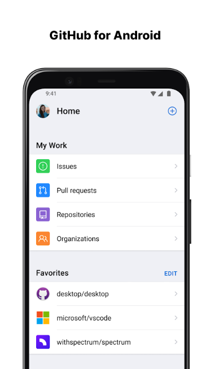
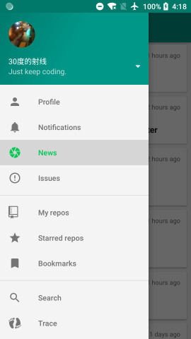

# GitHub for Android

GitHub 官方终于发布了 Android 应用，本文介绍其主要功能和使用体验。

<!-- more -->

这里是原文内容...

## 主要功能

- 功能1
- 功能2
- 功能3

## 使用体验

具体的使用体验内容...

## 总结

总结内容...

# GitHub for Android 
<meta name="keywords" content="Download,GitHub,Android"/>

昨天收到测试版本邮件通知

> GitHub
Thanks for signing up for the GitHub for Android beta. It's here, and as one of the early waitlist members, we're letting you know a little early.
Visit Google Play to download the app—participation is limited. We appreciate your feedback to make the experience ready for general availability soon!

### Download the GitHub for Android beta
[https://play.google.com/store/apps/details?id=com.github.android](https://play.google.com/store/apps/details?id=com.github.android)

## 应用截图

## 评价
我原本以为可以在官方APP 客户端上直接看代码，结果发现查看代码的功能都没有，毕竟测试版本，不知道正式版出来后功能会不会增加。目前建议观望不用着急上车。
不如现在 Play 市场上的 "OpenHub for GitHub" 实用 推荐一下。

GooglePlay：[https://play.google.com/store/apps/details?id=com.thirtydegreesray.openhub](https://play.google.com/store/apps/details?id=com.thirtydegreesray.openhub)

酷安：[https://www.coolapk.com/apk/com.thirtydegreesray.openhub](https://www.coolapk.com/apk/com.thirtydegreesray.openhub)

