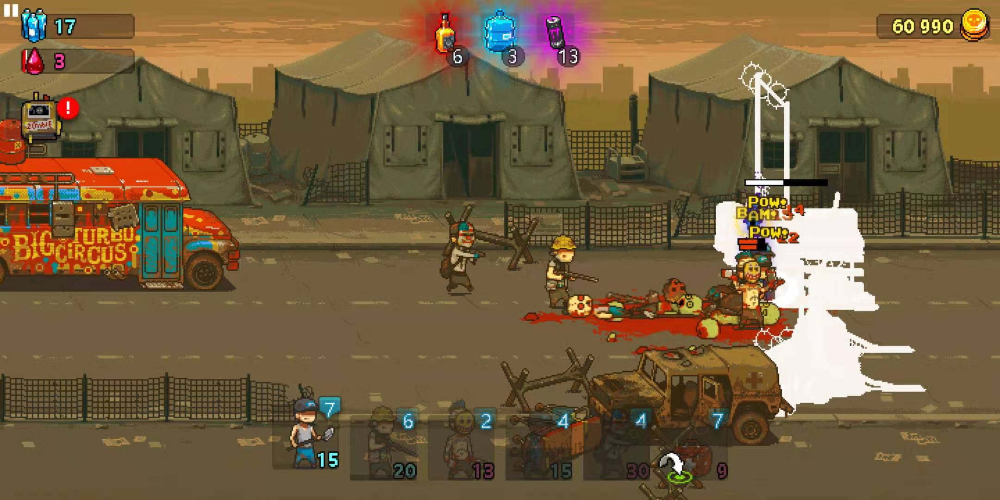
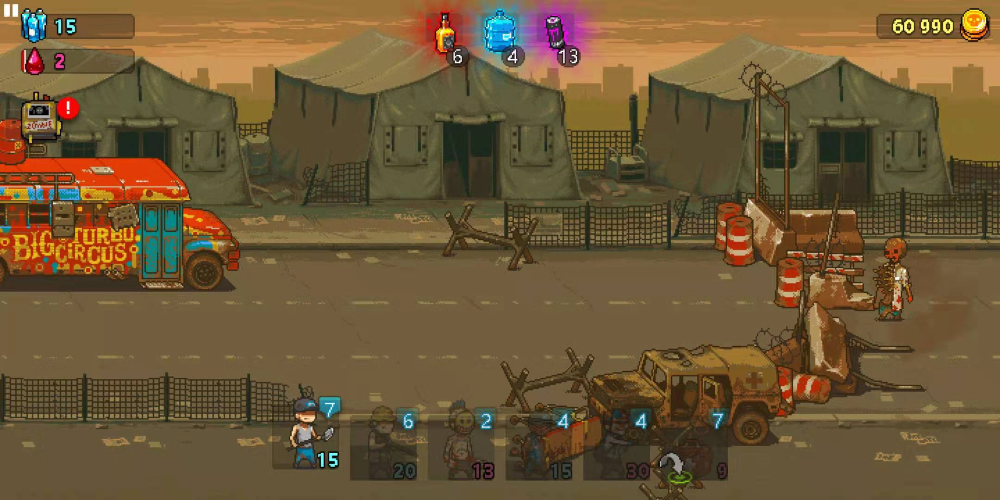
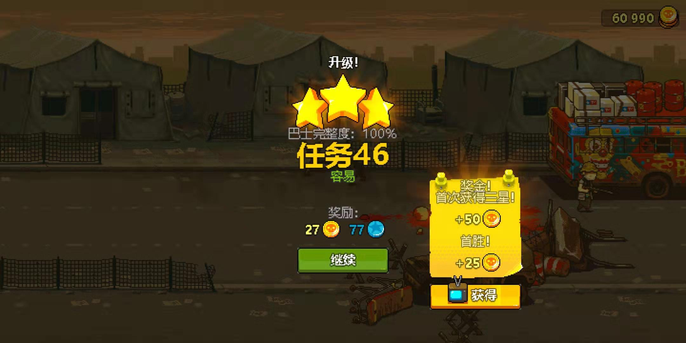

# DEAD AHEAD: ZOMBIE WARFARE 

## 画面

从截图上就可以看到，游戏基本的画风了，很多细节的地方觉得游戏画师还是很用心的。过关就是刷地图，从大巴派遣突围小队，根据蓝 消耗数来出击士兵，（有点想卡片？🤔人物不可操作，会自动打怪过关卡）喜欢这个游戏的一个点就是因为画风。

## 操作

写着就发现属于我这种老年大叔玩的游戏，不拼操作和反应，基本点点点 还是够玩的，不过刷了两把我就觉得刷完估计要肝很久吧，途中肯定会有很多重启刷刷刷的操作，我基本当作单机玩的，游戏有一个联机的模式，我并没有加入，这个有原因后文我会提到为啥。

## 其他

可以看到截图我的钞票和金币数量，白嫖党表示并没有氪金~ 我用了修改器发现可以直接修改金钱数，所以就体验了一把氪金玩家的爽快感觉😂,通过修改后的钞票我在商店开了很多的箱子和道具，游戏每天会刷新商店，基本上能用钞票买的我都买，新人物、新皮肤、新道具，但是有些是需要连接GooglePlay 我就没法操作了。

游戏内提供看广告拿金币的机制，一开始看了不少广告，真的是看广告时间比玩游戏时间还长的感觉，游戏已经做的很克制了，毕竟要盈利，广告的位置也藏的很深不会影响游戏体验，总的来说还是挺用心的。我感觉如果不氪金很难支持到后期，除非愿意重复的刷刷刷，以及不去看犯人的广告。所以如果已经修金额后也没有导致游戏平衡性变差，就是难度降低，更加容易刷图了。这样就可以一直刷下去了😁 僵尸有非常多种类，有一个图鉴可以收集，看到其他人的游戏截图看到有很夸张的僵尸造型，希望自己没在打到前就弃坑。

原本以为是单机游戏，结果发现也是要联网的，所以没办法断网期间解闷用，偶尔无聊玩玩还是可以的。

<!-- 来必力City版安装代码 -->

	
<noscript> 为正常使用来必力评论功能请激活JavaScript</noscript>

<!-- City版安装代码已完成 -->