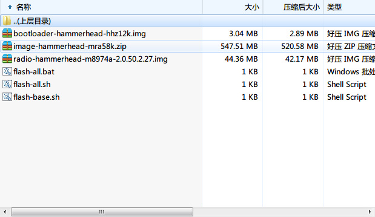
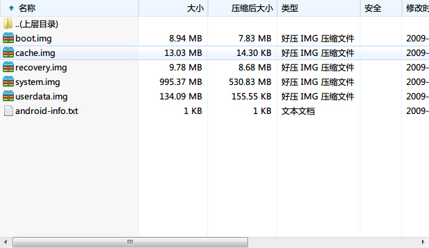
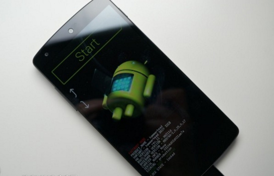
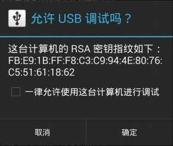
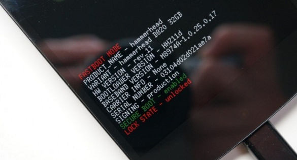

# Google Nexus5 android 6.0.1 & root

因为安迪的手机是Nexus 5，所以也写总结，手机用了有3年了，写一些平时需要用的东西供大家参考。

&nbsp;
<h3>系统下载</h3>
谷歌官方镜像下载 ：<a href="https://developers.google.com/android/nexus/images#volantislrx21l">https://developers.google.com/android/nexus/images#volantislrx21l</a>
<h4 id="hammerhead">"hammerhead" for Nexus 5 (GSM/LTE)</h4>
<table class="table table-bordered table-striped table-condensed">
<tbody>
<tr>
<td><b>Version</b></td>
<td><b>Download</b></td>
<td><b>MD5 Checksum</b></td>
<td><b>SHA-1 Checksum</b></td>
</tr>
<tr>
<td>4.4 (KRT16M)</td>
<td><a href="https://dl.google.com/dl/android/aosp/hammerhead-krt16m-factory-bd9c39de.tgz">Link</a></td>
<td>36aa82ab2d7d05ee144d18546565cd5f</td>
<td>bd9c39ded5dc0ac80c4e96d24db060a660266033</td>
</tr>
<tr>
<td>4.4.2 (KOT49H)</td>
<td><a href="https://dl.google.com/dl/android/aosp/hammerhead-kot49h-factory-02006b99.tgz">Link</a></td>
<td>fa3bdfbef24c25b48d4969e0925bc600</td>
<td>02006b9917ae3f470d29644023b7c843ec96aa03</td>
</tr>
<tr>
<td>4.4.3 (KTU84M)</td>
<td><a href="https://dl.google.com/dl/android/aosp/hammerhead-ktu84m-factory-53ff95bf.tgz">Link</a></td>
<td>34a201b32259aadcc8c4879e45c1575c</td>
<td>53ff95bf3912814b745e65cab6bc111bde987537</td>
</tr>
<tr>
<td>4.4.4 (KTU84P)</td>
<td><a href="https://dl.google.com/dl/android/aosp/hammerhead-ktu84p-factory-35ea0277.tgz">Link</a></td>
<td>d450411b40a6e60884c8e419bd50db2b</td>
<td>35ea0277bd6a8fc928b47256bfa97b2eed60746b</td>
</tr>
<tr>
<td>5.0 (LRX21O)</td>
<td><a href="https://dl.google.com/dl/android/aosp/hammerhead-lrx21o-factory-01315e08.tgz">Link</a></td>
<td>761667f1ddaf4e38d4792136df4ab927</td>
<td>01315e08c7f282452b5eba0606dd5a2d5274edde</td>
</tr>
<tr>
<td>5.0.1 (LRX22C)</td>
<td><a href="https://dl.google.com/dl/android/aosp/hammerhead-lrx21o-factory-01315e08.tgz">Link</a></td>
<td>f769bb85b7a82c1b4f7cc88f0d42129d</td>
<td>0f9eda1b8c801bec45f762c96121e7ae905976c0</td>
</tr>
<tr>
<td>5.1.0 (LMY47D)</td>
<td><a href="https://dl.google.com/dl/android/aosp/hammerhead-lmy47d-factory-6c1ad81e.tgz">Link</a></td>
<td>021fa0ed4946e0c7e70e39da301e5a34</td>
<td>6c1ad81eb8b90b329da5ed534af6ef18dea9921c</td>
</tr>
<tr>
<td>5.1.0 (LMY47I)</td>
<td><a href="https://dl.google.com/dl/android/aosp/hammerhead-lmy47i-factory-df127988.tgz">Link</a></td>
<td>d78c50bc06fe37a19536cbca0a17394a</td>
<td>df127988e25758e683d53df9767cc799ee113935</td>
</tr>
<tr>
<td>5.1.1 (LMY48B)</td>
<td><a href="https://dl.google.com/dl/android/aosp/hammerhead-lmy48b-factory-596bb9c1.tgz">Link</a></td>
<td>2002e1b813921b1dfc67aca09c30a171</td>
<td>596bb9c125525ce5baf4762a1cac6f5880c50cbc</td>
</tr>
<tr>
<td>5.1.1 (LMY48I)</td>
<td><a href="https://dl.google.com/dl/android/aosp/hammerhead-lmy48i-factory-a38c3441.tgz">Link</a></td>
<td>c513af4e908a74545ad5a19cfd54d6f3</td>
<td>a38c34411f2be783d7fe6dd3b873853db06e776a</td>
</tr>
<tr>
<td>5.1.1 (LMY48M)</td>
<td><a href="https://dl.google.com/dl/android/aosp/hammerhead-lmy48m-factory-bf3c82fd.tgz">Link</a></td>
<td>8eb950a77a3769070600c93b9572e5c0</td>
<td>bf3c82fde083b864e11034a59db4d53a605186f1</td>
</tr>
<tr>
<td>6.0.0 (MRA58K)</td>
<td><a href="https://dl.google.com/dl/android/aosp/hammerhead-mra58k-factory-52364034.tgz">Link</a></td>
<td>159361223f975326fc261bb48def426b</td>
<td>52364034a9e22d7622c397abe59495fcbdc9c79c</td>
</tr>
<tr>
<td>6.0.0 (MRA58N)</td>
<td><a href="https://dl.google.com/dl/android/aosp/hammerhead-mra58n-factory-aeca4139.tgz">Link</a></td>
<td>2580949f086418add154059f2833d3b9</td>
<td>aeca4139183cbdb077c4c4225711e863cbdbe513</td>
</tr>
<tr>
<td>6.0.1 (MMB29K)</td>
<td><a href="https://dl.google.com/dl/android/aosp/hammerhead-mmb29k-factory-1943f0f5.tgz">Link</a></td>
<td>7acd7b5fea099006eb60ef8dbda2a917</td>
<td>1943f0f587f19fc35eab03202316d434ac45dbf8</td>
</tr>
</tbody>
</table>
百度网盘：<a href="http://pan.baidu.com/s/1jGVqI0m">http://pan.baidu.com/s/1jGVqI0m</a>
<h3>刷机教程</h3>
1.adb和fastboot驱动

百度网盘：<a href="http://pan.baidu.com/s/1i422M2p">http://pan.baidu.com/s/1i422M2p</a>

将里面名称中含有adb和fastboot.exe都复制到 c:/windows/system32下

然后再将名称中含有adb的所有文件复制到 c:/windows/system

2.解压系统镜像包

再解压 image 包（最大的那个包）

将所有的文件解压到 d:\n5

开始菜单→运行→cmd

3.将您的nexus 5调整到bootloader模式，具体的办法是先关机，然后再开机，同时按住电源和音量上和音量下键。

<pre class="lang:sh decode:true">fastboot flash bootloader bootloader-hammerhead-hhz12h.img
fastboot flash radio radio-hammerhead-m8974a-2.0.50.2.26.img
fastboot reboot-bootloader
fastboot flash recovery recovery.img
fastboot flash boot boot.img
fastboot flash system system.img</pre>
fastboot flash bootloader “已最新包解压的bootloader包名为准”

fastboot flash radio  “已最新包解压的radio包名为准”

如果您想清除数据的话，就再刷入
<pre class="lang:sh decode:true">fastboot flash cache cache.img
fastboot flash userdata userdata.img</pre>
然后大功告成！
<h3>解锁教程</h3>
这里再重申一下关于手机解锁的说明：
好处：如果你的手机解锁了，可以刷第三方的recovery的，可以刷论坛上提供的各种rom刷机包，刷自己喜欢的刷机包。另外也只有先解锁才能Root。
坏处：如果你的手机解锁了，要是有问题，是不可以保修的，如果要保修的话，自己还得刷回官方的版本，然后恢复到锁定状态。

1.adb和fastboot驱动

百度网盘：<a href="http://pan.baidu.com/s/1i422M2p">http://pan.baidu.com/s/1i422M2p</a>

将里面名称中含有adb和fastboot.exe都复制到 c:/windows/system32下

然后再将名称中含有adb的所有文件复制到 c:/windows/system

2.进入设置-&gt;关于手机-&gt;版本号，点击5或6次'版本号'就能启动“开发者选项”

3.进入开发者选项，勾选USB调试的复选框，确定选择“一律允许此计算机进行调试”

4.连接你的手机到电脑。

5.一旦你已经给你的电脑调试访问,这是时间的命令。输入一个命令提示符(开始菜单→运行→cmd)
<pre class="lang:sh decode:true ">adb reboot bootloader</pre>

6.等待bootloader界面在屏幕上出现。fastboot oem unlock

7.一个unlock bootloader的选择确认页面会出现。用音量来选择到“YES,”，用电源键来确定。

8.这时你手机上的所有数据都将被抹去,LOCK STATE将变成unlocked。不应该超过一两分钟。

9.好了就此你的bootloader（引导装载程序）现在已经解锁,你应该看到屏幕上显示“START“用电源键选择并让手机重启。

在重新启动后,你的手机将完成出厂设置.
<h3>Root教程</h3>
<strong>5.0ROOT</strong>

步骤：
1.将您的nexus 5调整到bootloader模式，具体的办法是先关机，然后在关机的状态下，同时按住电源和音量上和音量下键。
2.通过USB将nexus 5和电脑相连接。
3.从<a href="http://autoroot.chainfire.eu/" target="_blank">http://autoroot.chainfire.eu</a>下载nexus 5对应的CF-Auto-Root版本

官方地址：<a href="https://download.chainfire.eu/363/CF-Root1/CF-Auto-Root-hammerhead-hammerhead-nexus5.zip?retrieve_file=1" target="_blank">https://download.chainfire.eu/363/CF-Root1/CF-Auto-Root-hammerhead-hammerhead-nexus5.zip?retrieve_file=1</a>

百度网盘：<a href="http://pan.baidu.com/s/1qXv2UWO" target="_blank">http://pan.baidu.com/s/1qXv2UWO</a>
下载完成后解压该包.
4.运行脚本实现一键root
如果您使用的是windows系统的话
--- 双击运行root-windows.bat
- Linux
--- chmod +x root-linux.sh
--- 运行 root-linux.sh
- Mac OS X
--- chmod +x root-mac.sh
--- 运行 root-mac.sh

&nbsp;

<strong>5.1 5.1.1 ROOT</strong>

先解锁，然后安装第三方recovery twrp，通过其install功能来刷入supersu.zip来实现root！

刷入twrp方法： 参加刷机教程
<pre class="lang:sh decode:true">fastboot flash recovery recovery.img</pre>
只不过将 recovery.img 名字换成 openrecovery-twrp-2.8.5.2-hammerhead.img

将手机进入fastboot模式，电脑端输入fastboot flash recovery twrp的文件名.img 来实现安装twrp

然后进入recovery模式，利用twrp的install来选择SDcard安装 supersu.zip，然后刷入重启即可安卓5.1.1的root。

百度网盘：<a href="http://pan.baidu.com/s/1kUqTztd">http://pan.baidu.com/s/1kUqTztd</a>

&nbsp;

<strong>6.0ROOT</strong>

目前大神Chainfire提供了临时的nexus 5设备安卓6.0的修改版内核，通过刷入对应设备的boot.img后，再刷入twrp等第三方的recovery，通过twrp的install来刷入supersu 2.50 beta版的zip来实现root.

刷入twrp方法： 参加刷机教程

将手机进入bootloader模式，然后电脑端在命令提示符里输入相应的dos命令进入twrp包所在目录，然后输入fastboot flash recovery twrp的文件名.img 来实现安装twrp

刷入了twrp等第三方的recovery：<a class=" external" href="http://link.zhihu.com/?target=http%3A//teamw.in/project/twrp2/" target="_blank" rel="nofollow noreferrer">http://teamw.in/project/twrp2/</a>
<pre class="lang:sh decode:true">fastboot flash recovery recovery.img</pre>
nexus 5：<a class=" wrap external" href="http://link.zhihu.com/?target=http%3A//forum.xda-developers.com/attachment.php%3Fattachmentid%3D3499079%26d%3D1444242551" target="_blank" rel="nofollow noreferrer">hammerhead-mra58k-boot.zip</a>
<pre class="lang:sh decode:true">fastboot flash boot boot.img</pre>
supersu 2.50 beta版下载地址：<a class=" external" href="http://link.zhihu.com/?target=https%3A//download.chainfire.eu/741/SuperSU/BETA-SuperSU-v2.50.zip%3Fretrieve_file%3D1" target="_blank" rel="nofollow noreferrer">https://download.chainfire.eu/741/SuperSU/BETA-SuperSU-v2.50.zip?retrieve_file=1</a>

然后进入recovery模式，利用twrp的install来选择SDcard安装BETA-SuperSU-v2.50.zip，然后刷入重启即可完成安卓<strong>6.0 </strong>的root。

百度网盘：<a href="http://pan.baidu.com/s/1bs7EUy">http://pan.baidu.com/s/1bs7EUy</a>

&nbsp;

<strong>6.0 &amp; 6.0.1ROOT</strong>

supersu 2.52 beta版下载地址：<a href="http://download.chainfire.eu/743/SuperSU/BETA-SuperSU-v2.52.zip" target="_blank">http://forum.xda-developers.com/attachment.php?attachmentid=3571657&amp;d=1449763480</a>

百度网盘：<a href="http://pan.baidu.com/s/1dEiYhzV">http://pan.baidu.com/s/1dEiYhzV</a>

然后进入recovery模式，利用twrp的install来选择SDcard安装BETA-SuperSU-v2.52.zip，然后刷入重启即可安卓<strong>6.0 &amp; 6.0.1</strong>的root。

&nbsp;

参见：http://www.inexus.co/