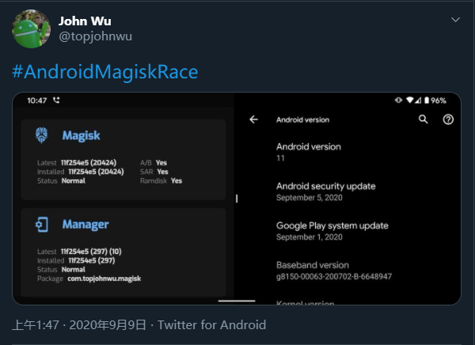
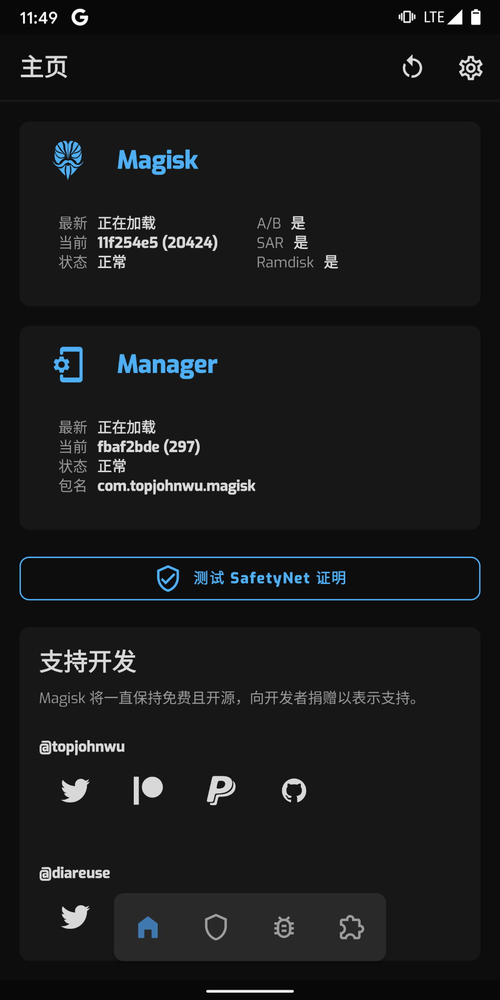

# Google Pixel 2 xl update Android 11 & root


9号起床，收到邮件通知
> check out these new Pixel features


看到推特上，John Wu 也更新了 root 成功的截图。准备 ~ 开搞！



## 备份

- 微信导出（微信PC）
- 备份联系人、备份短信、备份通话记录 （QQ同步助手）
- 备份WiFi连接（钛备份）
- 钛备份所有app（钛备份）
- SD卡内容导出（HandShaker）

## 系统下载

谷歌官方手机系统下载地址:

[https://developers.google.com/android/images#taimen](https://developers.google.com/android/images#taimen)   (原版)

[https://developers.google.cn/android/images#taimen](https://developers.google.cn/android/images#taimen)  （国内 免翻墙下载）

## 驱动下载

[https://developer.android.com/studio/run/win-usb](https://developer.android.com/studio/run/win-usb) （adb 线刷驱动）

adb-fastboot-v4

[https://pan.baidu.com/s/1Lk1xYFvg9lxKpjZt-N9wcw](https://pan.baidu.com/s/1Lk1xYFvg9lxKpjZt-N9wcw)

## 升级工具下载

- [https://twrp.me/Devices/](https://twrp.me/Devices/) (下载地址 设备搜索)
- [twrp-3.4.0-1-taimen.img](https://eu.dl.twrp.me/taimen/twrp-3.4.0-1-taimen.img)
- [https://magisk.cc/](https://magisk.cc/ ) （magisk 下载地址 国内源地址）
- [https://magisk.cc/magisk_files.php?type=debug](https://magisk.cc/magisk_files.php?type=debug ) （debug版本下载地址）

## 系统解压
**taimen-rp1a.200720.009-factory-f2d162ef.zip**

- image-taimen-rp1a.200720.009.zip
    - **boot.img**
    - dtbo.img
    - system.img
    - system_other.img
    - vbmeta.img
    - vendor.img

**bootloader-taimen-tmz30m.img**

**radio-taimen-g8998-00034-2006052136.img**

## 装系统
```shell
# 自动
flash-all.bat

# 手动
fastboot flash bootloader bootloader-taimen-tmz30m.img
fastboot reboot-bootloader

fastboot flash radio radio-taimen-g8998-00034-2006052136.img
fastboot reboot-bootloader

fastboot update image-taimen-rp1a.200720.009.zip

```

## magisk 安装 & root

1. 安装上面已经下载好的 magisk 金丝雀版
[https://magisk.dw.qzrom.cn/topjohnwu/magisk_files/canary/app-debug.apk](https://magisk.dw.qzrom.cn/topjohnwu/magisk_files/canary/app-debug.apk)

2. 拷贝 **image-taimen-rp1a.200720.009.zip** 解压出的 **boot.img** 到手机根目录

3. 打开 magisk 点击安装 Manager 安装完成，点击magisk 安装，**选择并修补一个文件** 选择手机根目录中的 **boot.img**  之后程序会刷入修改 生成 **magisk_patched.img**，将 **magisk_patched.img** 拷贝到电脑前。

4. bootloader 模式，将 magisk_patched.img 刷入 `fastboot flash boot magisk_patched.img`

5. 刷入完成后 开机（开机可能要很久等就完事了） 查看 magisk 状态



之后开始漫长的恢复。

## 结束语
每年这个时候刷机我都会选择删掉系统所有数据重装，当然前提是备份好自己的重要数据

<hr>

<!-- 来必力City版安装代码 -->
<div id="lv-container" data-id="city" data-uid="MTAyMC80NzA4OC8yMzU4OA==">
	<script type="text/javascript">
   (function(d, s) {
       var j, e = d.getElementsByTagName(s)[0];

       if (typeof LivereTower === 'function') { return; }
    
       j = d.createElement(s);
       j.src = 'https://cdn-city.livere.com/js/embed.dist.js';
       j.async = true;
    
       e.parentNode.insertBefore(j, e);
   })(document, 'script');
	</script>
<noscript> 为正常使用来必力评论功能请激活JavaScript</noscript>
</div>
<!-- City版安装代码已完成 -->