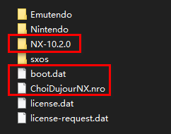

# Switcch 破解系统TX 升级 10.2.0

> 破解系统版本要高于正版系统，破解系统升级后，正版系统就可以升级了，没必要升级最新系统，除非游戏必须要求最低系统版本。

## B站视频/ Youtube视频

<iframe width="820" height="460"  src="https://player.bilibili.com/player.html?aid=415582447&bvid=BV1dV41187W5&cid=265141499&page=1" scrolling="no" border="0" frameborder="no" framespacing="0" allowfullscreen="true"> </iframe>

<iframe width="820" height="460" src="https://www.youtube.com/embed/Kzic2XvDFH4" frameborder="0" allow="accelerometer; autoplay; clipboard-write; encrypted-media; gyroscope; picture-in-picture" allowfullscreen></iframe>

## **升级文件**

- ChoiDujourNX.nro  （升级工具）

- boot.dat  （新系统boot 文件）

- NX-10.2.0/*..nca  (219个 固件包) 

百度云 链接: [https://pan.baidu.com/s/1JzRvLDM-JOKdD4a1a21KCw](https://pan.baidu.com/s/1JzRvLDM-JOKdD4a1a21KCw) 提取码: h6ad

  

## **拷贝文件**

将两个文件 一个目录都拷贝到SD卡**根目录中**,拷贝完成后插入SD卡，开机。

## **升级操作**

1. 开机后进入菜单 HOMEBEREW,触屏点击小白兔图标

2. 触屏点击[NX-10.2.0] 文件夹

   

3. 打开后点击choose 

   

4. 等待进度条走完 点击 10.2(exFAT) 按钮

   

5. 等进度条走完，选择右下加的select firmware

   

6. 最后希纳是下面这个节目 点击右下角的start inatallation

   

7. 等待升级完成，点击reboot 重启机器，重启完成机器就升级完成了。

   

8. 重启等待进度条走完就行了。

   

## 注意:目前最新系统更新问题

| 正版系统版本 | 破解系统版本 | 状态       |
| ------------ | ------------ | ---------- |
| 10.1         | 10.2         | √          |
| 10.1         | 11.0         | X 插卡报错 |
| 11.0.1       | 11.0         | X          |

目前我卡在了 10.1 / 11.0  插卡报错的 状态了，只能等待新的破解系统更新才能 恢复正版系统卡带的使用，这个坑我提前替大家踩了，请注意。

   

<!-- 来必力City版安装代码 -->

	
<noscript> 为正常使用来必力评论功能请激活JavaScript</noscript>

<!-- City版安装代码已完成 -->